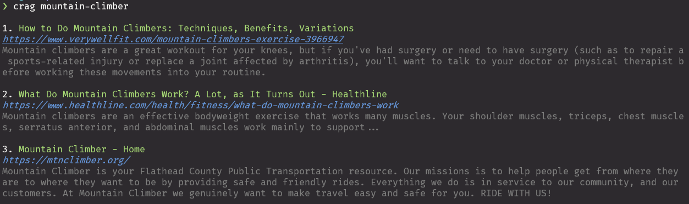

# Crag

`crag` is a *c*ommand-line *r*ust based application and library for *a*cessing (*g*oogle) search results.



## Quickstart: CLI

If you already have rust and cargo installed, you can install `crag` directly from crates.io:

```console
cargo install --features=cli crag
```

### Usage

To search with `crag`, just run `crag [SEARCH]`, and wait for the results -- it's really that simple.

```console
crag mountain-climbing
```

Of course, `crag` also supports several flags that modify the results returned by your search. The tool ships with built-in help text that describes the various options:

```console 
crag --help
...
```

## Quickstart: Lib

Add `crag` to your project in your `Cargo.toml`:

```toml
crag = "0.4.0"
```

### Usage

From a high level, `crag` uses search engine implementations to execute search queries and return a vector of results.
Queries, engine settings, and search results are all static types; the actual search engine used should be interchangeable for any given query.

So if you want to point `crag` at your custom `searx` server, it's as simple as implementing the `Soap` trait for that engine.

`crag` also provides search implementations out-of-the-box, so you can get to searching:

Check out the API docs for usage examples and detailed information: https://docs.rs/crag

## Overview

### Features

- [x] Searches things (from the command line!)
- [x] Clean search result display
- [x] Cross-platform
- [x] Integrates with your project as a library
- [ ] Optional interactive search result navigation
- [ ] Supports multiple search engines
- [ ] ...

## Alternatives

- [googler](https://github.com/jarun/googler): The _de facto_ standard (and probably best) command line google application, but it is currently archived.
